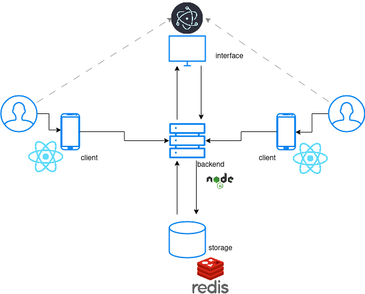

# Groggy Rock
This is to be a party game where players will connect and join on their mobile devices and set themselves into dice rolls, timers and randomised ruling.
## Structure


## Running redis storage backend

```sh
docker run --name=redis --network=groggy -p 6379:6379 --restart=unless-stopped
```


## Running with k8s (WIP)
* Going to require Pod(s) for
    * Interface
    * Backend
    * Frontend
* Going to need a service between
    * backend and interface
    * client and backend